<h2 align="center">
    <samp>&gt; HelloWorld(), I am <b><a target="_blank" href="https://rafaelantunes.vercel.app">Rafael // guf1ck // Antunes</a></b></samp>
    
</h2>

<!-- Terminal Section -->

<h3><code>guf1ck@github ~ $ whoami</code></h3>
<table>
  <tr>
    <td valign="top"></td>
    <td valign="top"></td>
  </tr>
</table>

 

<h3><code>guf1ck@github ~ $ ./contributions.sh</code></h3>

 

## 💻 Languages & Skills

 
 <h2 align="center">Discord Profile</h2> 
  

    

  

  <i>&nbsp; "Too many of us are not living our dreams because we are living our fears...."</i> 
 

